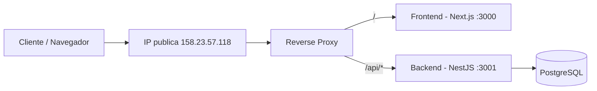

# Plataforma Digital para la Colaboracion Interdisciplinaria entre Asociaciones Estudiantiles Universitarias

<p align="center">
  
  
  
  
  
</p>

Plataforma para centralizar proyectos extracurriculares y de investigacion en UVG, conectando estudiantes, asociaciones e institutos academicos en un solo sistema.

---

## Informacion General

| Campo | Detalle |
|---|---|
| Curso | CC3058 - Ingenieria de Software 1 |
| Seccion | 30 |
| Docente | Lynette Garcia |
| Universidad | Universidad del Valle de Guatemala |
| Semestre | Semestre I - 2026 |

---

## Equipo

| Nombre | Carne | GitHub |
|---|---|---|
| Angel Gabriel Sanabria Morales | 24725 | [@asanabria-2021067](https://github.com/asanabria-2021067) |
| Saul Esteban Castillo Arenas | 24915 | [@llAkihitoll](https://github.com/llAkihitoll) |
| Vernel Josue Hernandez Caceres | 24584 | [@Junjey123-mx](https://github.com/Junjey123-mx) |
| Derek Friedhelm Coronado Chilin | 24732 | [@dcoronado91](https://github.com/dcoronado91) |
| Samuel Antonio Robledo Lopez | 241282 | [@samuelrobledo52](https://github.com/samuelrobledo52) |

---

## Estado Actual (Cortes + Scrum)

### Cortes academicos

- [x] Corte 1 - Empatizar y Definir
- [x] Corte 2 - Idear y Modelar
- [x] Corte 3 - Prototipar y Base de Datos

### Scrum

- [x] Sprint 1 completado
- [x] Sprint 2 completado

### Avance funcional implementado

Backend (NestJS + Prisma):

- Autenticacion (`/auth/login`, `/auth/register`)
- Perfil de usuario (`/usuarios/me`, perfil, habilidades, intereses, cualidades, experiencias)
- Proyectos (`/proyectos`): crear, editar, listar, cambiar estado, flujo de revision y cierre
- Postulaciones (`/postulaciones`): crear, listar, resolver estado
- Revisiones (`/revisiones`) y mensajes de revision (`/mensajes-revision`)
- Tareas (`/tareas`), evidencias (`/evidencias`) y comentarios (`/comentarios`)
- Notificaciones (`/notificaciones`)
- Catalogos (`/catalogs`, `/carreras`, `/habilidades`, `/intereses`, `/cualidades`)

Frontend (Next.js):

- Landing page
- Login y registro
- Dashboard general
- Mis proyectos, proyectos publicados y detalle de proyecto
- Flujo de postulacion por rol
- Mis postulaciones
- Perfil de usuario
- Vista de revisiones para admin

---

## Stack Tecnologico (actual del repo)

| Capa | Tecnologia | Version |
|---|---|---|
| Backend | NestJS | 11.x |
| ORM | Prisma | 6.19.2 |
| Base de datos | PostgreSQL | 17 (Docker) |
| Frontend | Next.js | 16.2.0 |
| UI | React | 19.2.4 |
| Lenguaje | TypeScript | 5.7.x |
| Testing | Vitest | 3.2.4 |
| Contenedores | Docker Compose | v2+ |
| Runtime | Node.js | 22+ |

---

## Arquitectura del Monorepo

```txt
proyecto-ingenieria-software
├─ apps/
│  ├─ backend/                 # API NestJS + Prisma
│  │  ├─ src/                  # Modulos del backend
│  │  ├─ prisma/               # Schema, migraciones y seed
│  │  ├─ Dockerfile
│  │  └─ Dockerfile.dev
│  └─ frontend/                # Next.js App Router
│     ├─ app/                  # Rutas y paginas
│     ├─ components/           # Componentes UI
│     ├─ lib/                  # Servicios, DTOs y utilidades
│     ├─ hooks/
│     ├─ public/
│     ├─ Dockerfile
│     └─ Dockerfile.dev
├─ Corte 1/
├─ Corte 2/
├─ Corte 3/
├─ Avances 1/
├─ Avances 2/
├─ Scrum/
│  ├─ Sprint 1/
│  └─ Sprint 2/
├─ docker-compose.yml
├─ docker-compose.dev.yml
├─ .env.example
└─ README.md
```

### Flujo en produccion (reverse-proxy)

Como el proyecto es monorepo, el frontend y backend viven en el mismo despliegue.  
Se usa un reverse-proxy para exponer una sola IP publica y redirigir trafico segun la ruta:

- `/` -> Frontend (Next.js)
- `/api/*` -> Backend (NestJS)



---

## Configuracion del Entorno

### Prerrequisitos

- Node.js 22+
- Docker Desktop
- npm

### 1) Clonar y variables de entorno

```bash
git clone <url-del-repositorio>
cd proyecto-ingenieria-software
```

Linux/macOS:

```bash
cp .env.example .env
```

PowerShell:

```powershell
Copy-Item .env.example .env
```

### 2) Levantar entorno con Docker

Todo el entorno (DB + Backend + Frontend):

```bash
docker compose --profile app up -d --build
```

Solo base de datos + pgAdmin:

```bash
docker compose up -d
```

Modo desarrollo con hot reload (backend + frontend):

```bash
docker compose -f docker-compose.yml -f docker-compose.dev.yml --profile app up -d --build
```

### 3) URLs locales

| Servicio | URL |
|---|---|
| Frontend | http://localhost:3000 |
| Backend API | http://localhost:3001 |
| pgAdmin | http://localhost:5050 |
| Prisma Studio | http://localhost:5555 |

### 3.1) URL publica (hosteado)

- Aplicacion: http://158.23.57.118/

### 4) Desarrollo local (sin contenedores de app)

```bash
# Backend
cd apps/backend
npm install
npm run start:dev

# Frontend (otra terminal)
cd apps/frontend
npm install
npm run dev
```

### 5) Base de datos (Prisma)

```bash
cd apps/backend
npx prisma migrate dev
npm run prisma:seed
npm run prisma:generate
```

---

## Comandos Utiles

### Backend

```bash
cd apps/backend
npm run start:dev
npm run build
npm run test
npm run prisma:studio
npm run prisma:migrate
npm run prisma:seed
```

### Frontend

```bash
cd apps/frontend
npm run dev
npm run build
npm run test
npm run lint
```

### Docker

```bash
# Ver estado
docker ps

# Ver logs
docker compose logs -f backend
docker compose logs -f frontend
docker compose logs -f postgres

# Detener
docker compose --profile app down
```

---

## Usuarios Seed de Prueba

Todos usan la misma contrasena: `Test1234!`

- `carlos.mendoza@uvg.edu.gt`
- `maria.lopez@uvg.edu.gt`
- `jose.ramirez@uvg.edu.gt`
- `ana.garcia@uvg.edu.gt`
- `luis.hernandez@uvg.edu.gt`
- `sofia.martinez@uvg.edu.gt`

---

## Recursos y Entregables

| Recurso | Enlace |
|---|---|
| Informe Corte 1 | [Ver PDF](Corte%201/informe/Software%20Corte%201.pdf) |
| Informe Corte 2 | [Ver PDF](Corte%202/informe/Software%20Corte%202.pdf) |
| Informe Corte 3 | [Ver PDF](Corte%203/informe/Software%20Corte%203.pdf) |
| DER del sistema | [Ver imagen](Corte%203/assets/DER.png) |
| Informe Sprint 1 | [Ver PDF](Scrum/Sprint%201/informe/Sprint%201%20Software.pdf) |
| Documento colaborativo Sprint 1 | [SharePoint](https://uvggt-my.sharepoint.com/:w:/g/personal/cor24732_uvg_edu_gt/IQCNDS1_2fGjRrLfY7EaD6RyAUgQs1A1iptdERqYPjgqQBA?e=NK0vXJ) |
| Informe Sprint 2 | [Ver PDF](Scrum/Sprint%202/informe/Sprint%202%20Software.pdf) |
| Documento colaborativo Sprint 2 | [SharePoint](https://uvggt-my.sharepoint.com/:w:/g/personal/cor24732_uvg_edu_gt/IQDXGK22EE8LQJGk14JsesC1Adyou9bIyMeo2zArJsTgB34?e=7EaqDO) |
| LOGT Sprint 1 | [Ver carpeta](Scrum/Sprint%201/gestion_tiempo/) |
| LOGT Sprint 2 | [Ver carpeta](Scrum/Sprint%202/gestion_tiempo/) |

---

<p align="center">
  Proyecto desarrollado para CC3058 - Ingenieria de Software 1 - UVG - 2026
</p>
