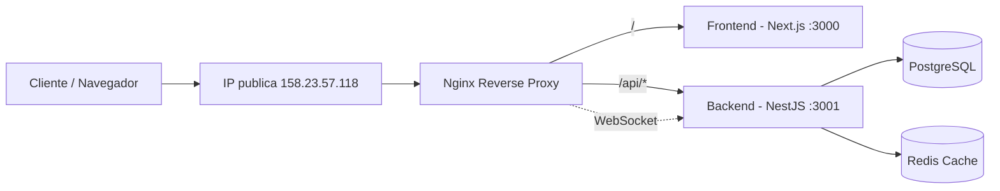

# Plataforma Digital para la Colaboracion Interdisciplinaria entre Asociaciones Estudiantiles Universitarias

<p align="center">
  
  
  
  
  
</p>

Plataforma para centralizar proyectos extracurriculares y de investigacion en UVG, conectando estudiantes, asociaciones e institutos academicos en un solo sistema.

---

## Informacion General

| Campo | Detalle |
|---|---|
| Curso | CC3058 - Ingenieria de Software 1 |
| Seccion | 30 |
| Docente | Lynette Garcia |
| Universidad | Universidad del Valle de Guatemala |
| Semestre | Semestre I - 2026 |

---

## Equipo

| Nombre | Carne | GitHub |
|---|---|---|
| Angel Gabriel Sanabria Morales | 24725 | [@asanabria-2021067](https://github.com/asanabria-2021067) |
| Saul Esteban Castillo Arenas | 24915 | [@llAkihitoll](https://github.com/llAkihitoll) |
| Vernel Josue Hernandez Caceres | 24584 | [@Junjey123-mx](https://github.com/Junjey123-mx) |
| Derek Friedhelm Coronado Chilin | 24732 | [@dcoronado91](https://github.com/dcoronado91) |
| Samuel Antonio Robledo Lopez | 241282 | [@samuelrobledo52](https://github.com/samuelrobledo52) |

---

## Estado Actual (Cortes + Scrum)

### Cortes academicos

- [x] Corte 1 - Empatizar y Definir
- [x] Corte 2 - Idear y Modelar
- [x] Corte 3 - Prototipar y Base de Datos

### Scrum

- [x] Sprint 1 completado
- [x] Sprint 2 completado
- [x] Sprint 3 completado
- [x] Sprint 4 completado

### Avance funcional implementado

Backend (NestJS + Prisma):

- Autenticacion (`/auth/login`, `/auth/register`, recuperacion de contrasena)
- Perfil de usuario (`/usuarios/me`, perfil, habilidades, intereses, cualidades, experiencias)
- Proyectos (`/proyectos`): crear, editar, listar, cambiar estado, flujo de revision y cierre, equipo
- Postulaciones (`/postulaciones`): crear, listar, resolver estado, cancelar
- Revisiones (`/revisiones`) y mensajes de revision (`/mensajes-revision`)
- Tareas (`/tareas`), evidencias (`/evidencias`) y comentarios (`/comentarios`)
- Notificaciones (`/notificaciones`): en tiempo real via WebSocket, templates, marcado de leidas
- Catalogos (`/catalogs`, `/carreras`, `/habilidades`, `/intereses`, `/cualidades`)
- Sistema de auditoria (BitacoraAuditoria)
- Cache con Redis para optimizacion de queries
- Rate limiting y validacion global
- Administracion (`/admin`): estadisticas de plataforma, gestion de usuarios, detalle de usuario
- Snapshot de estado en revisiones de proyecto

Frontend (Next.js):

- Landing page
- Login, registro (con auto-generacion de correo institucional) y recuperacion de contrasena
- Dashboard general
- Mis proyectos, proyectos publicados y detalle de proyecto
- Flujo de postulacion por rol con verificacion de estado activo
- Mis postulaciones (con opcion de cancelar)
- Perfil de usuario y vista de perfil especifica para admin
- Vista de revisiones para admin (por secciones, con feedback)
- Notificaciones en tiempo real con WebSocket
- Vista de equipo de proyecto
- Panel de administracion: dashboard, gestion de usuarios, drawer de detalle, metricas
- Historial de revisiones con snapshots e inbox de admin
- Modo edicion inline con visibilidad de feedback en revisiones
- Filtro de proyectos por organizacion
- Dark mode completo (SweetAlert2, Microsoft login button)
- SweetAlert2 configurado globalmente

---

## Stack Tecnologico (actual del repo)

| Capa | Tecnologia | Version |
|---|---|---|
| Backend | NestJS | 11.x |
| ORM | Prisma | 6.19.2 |
| Base de datos | PostgreSQL | 17 (Docker) |
| Cache | Redis | 7 (Docker) |
| Frontend | Next.js | 16.2.0 |
| UI | React | 19.2.4 |
| Lenguaje | TypeScript | 5.7.x |
| Testing | Vitest | 3.2.4 |
| Contenedores | Docker Compose | v2+ |
| Runtime | Node.js | 22+ |
| WebSockets | Socket.io | 4.7.x |
| Seguridad | Helmet, Throttler | Latest |

---

## Arquitectura del Monorepo

```txt
proyecto-ingenieria-software
├─ apps/
│  ├─ backend/                 # API NestJS + Prisma
│  │  ├─ src/                  # Modulos del backend
│  │  ├─ prisma/               # Schema, migraciones y seed
│  │  ├─ Dockerfile
│  │  └─ Dockerfile.dev
│  └─ frontend/                # Next.js App Router
│     ├─ app/                  # Rutas y paginas
│     ├─ components/           # Componentes UI
│     ├─ lib/                  # Servicios, DTOs y utilidades
│     ├─ hooks/
│     ├─ public/
│     ├─ Dockerfile
│     └─ Dockerfile.dev
├─ Corte 1/
├─ Corte 2/
├─ Corte 3/
├─ Avances 1/
├─ Avances 2/
├─ Scrum/
│  ├─ Sprint 1/
│  ├─ Sprint 2/
│  ├─ Sprint 3/
│  └─ Sprint 4/
├─ docker-compose.yml
├─ docker-compose.dev.yml
├─ .env.example
└─ README.md
```

### Flujo en produccion (reverse-proxy)

Como el proyecto es monorepo, el frontend y backend viven en el mismo despliegue.  
Se usa un reverse-proxy para exponer una sola IP publica y redirigir trafico segun la ruta:

- `/` -> Frontend (Next.js)
- `/api/*` -> Backend (NestJS)


```mermaid
flowchart LR
    A[Cliente / Navegador] --> B[IP publica 158.23.57.118]
    B --> C[Nginx Reverse Proxy]
    C -->|/| D[Frontend - Next.js :3000]
    C -->|/api/*| E[Backend - NestJS :3001]
    C -.WebSocket.-> E
    E --> F[(PostgreSQL)]
    E --> G[(Redis Cache)]
```

---

## Configuracion del Entorno

### Prerrequisitos

- Node.js 22+
- Docker Desktop
- npm

### 1) Clonar y variables de entorno

```bash
git clone <url-del-repositorio>
cd proyecto-ingenieria-software
```

Linux/macOS:

```bash
cp .env.example .env
```

PowerShell:

```powershell
Copy-Item .env.example .env
```

### 2) Levantar entorno con Docker

Todo el entorno (DB + Backend + Frontend):

```bash
docker compose --profile app up -d --build
```

Solo base de datos:

```bash
docker compose up -d
```

pgAdmin es una herramienta de desarrollo y queda detras de su propio perfil
(no se levanta con `up -d` ni con `--profile app`):

```bash
docker compose --profile tools up -d pgadmin
```

Modo desarrollo con hot reload (backend + frontend):

```bash
docker compose -f docker-compose.yml -f docker-compose.dev.yml --profile app up -d --build
```

### 3) URLs locales

| Servicio | URL |
|---|---|
| Frontend | http://localhost:3000 |
| Backend API | http://localhost:3001 |
| WebSocket | ws://localhost:3001/notifications |
| Redis | localhost:6379 |
| pgAdmin | http://localhost:5050 |
| Prisma Studio | http://localhost:5555 |

### 3.1) URL publica (hosteado)

- Aplicacion: http://158.23.57.118/

### 4) Desarrollo local (sin contenedores de app)

```bash
# Backend
cd apps/backend
npm install
npm run start:dev

# Frontend (otra terminal)
cd apps/frontend
npm install
npm run dev
```

### 5) Base de datos (Prisma)

```bash
cd apps/backend
npx prisma migrate dev
npm run prisma:seed
npm run prisma:generate
```

---

## Comandos Utiles

### Backend

```bash
cd apps/backend
npm run start:dev
npm run build
npm run test
npm run prisma:studio
npm run prisma:migrate
npm run prisma:seed
```

### Frontend

```bash
cd apps/frontend
npm run dev
npm run build
npm run test
npm run lint
```

### Docker

```bash
# Ver estado
docker ps

# Ver logs
docker compose logs -f backend
docker compose logs -f frontend
docker compose logs -f postgres
docker compose logs -f redis

# Bajar todo el entorno de la app
docker compose --profile app down

# Reiniciar todo el entorno de la app
docker compose --profile app restart

# Reiniciar un servicio
docker compose restart backend
docker compose restart redis
```

---

## Usuarios Seed de Prueba

Todos usan la misma contrasena: `Test1234!`

- `carlos.mendoza@uvg.edu.gt`
- `maria.lopez@uvg.edu.gt`
- `jose.ramirez@uvg.edu.gt`
- `ana.garcia@uvg.edu.gt`
- `luis.hernandez@uvg.edu.gt`
- `sofia.martinez@uvg.edu.gt`

---

## Recursos y Entregables

| Recurso | Enlace |
|---|---|
| Informe Corte 1 | [Ver PDF](Corte%201/informe/Software%20Corte%201.pdf) |
| Informe Corte 2 | [Ver PDF](Corte%202/informe/Software%20Corte%202.pdf) |
| Informe Corte 3 | [Ver PDF](Corte%203/informe/Software%20Corte%203.pdf) |
| DER del sistema | [Ver imagen](Corte%203/assets/DER.png) |
| Informe Sprint 1 | [Ver PDF](Scrum/Sprint%201/informe/Sprint%201%20Software.pdf) |
| Documento colaborativo Sprint 1 | [SharePoint](https://uvggt-my.sharepoint.com/:w:/g/personal/cor24732_uvg_edu_gt/IQCNDS1_2fGjRrLfY7EaD6RyAUgQs1A1iptdERqYPjgqQBA?e=NK0vXJ) |
| Informe Sprint 2 | [Ver PDF](Scrum/Sprint%202/informe/Sprint%202%20Software.pdf) |
| Documento colaborativo Sprint 2 | [SharePoint](https://uvggt-my.sharepoint.com/:w:/g/personal/cor24732_uvg_edu_gt/IQDXGK22EE8LQJGk14JsesC1Adyou9bIyMeo2zArJsTgB34?e=7EaqDO) |
| Informe Sprint 3 | [Ver PDF](Scrum/Sprint%203/informe/Sprint%203%20Software.pdf) |
| Documento colaborativo Sprint 3 | [SharePoint](https://uvggt-my.sharepoint.com/:w:/g/personal/cor24732_uvg_edu_gt/IQDXGK22EE8LQJGk14JsesC1Adyou9bIyMeo2zArJsTgB34?e=7EaqDO) |
| Documento colaborativo Sprint 4 | [SharePoint](https://uvggt-my.sharepoint.com/:w:/g/personal/cor24732_uvg_edu_gt/IQAWeb72X0lWQrc8plgabvJcATBowOuqNXGhBFK1Up3c7X4?e=Uo8pkt) |
| Documento Integrador | [SharePoint](https://uvggt-my.sharepoint.com/:w:/g/personal/cor24732_uvg_edu_gt/IQASzLTj192pQZTdhj_6kMggAWaP86cQI14ebOm3qI272sE?e=FgXHLa) |
| LOGT Sprint 1 | [Ver carpeta](Scrum/Sprint%201/gestion_tiempo/) |
| LOGT Sprint 2 | [Ver carpeta](Scrum/Sprint%202/gestion_tiempo/) |
| LOGT Sprint 3 | [Ver carpeta](Scrum/Sprint%203/gestion_tiempo/) |
| LOGT Sprint 4 | [Ver carpeta](Scrum/Sprint%204/gestion_tiempo/) |

---

## Caracteristicas Avanzadas

### Notificaciones en Tiempo Real (Sprint 3)
- WebSocket gateway con autenticacion JWT
- Notificaciones instantaneas al crear postulaciones
- Sistema de templates para mensajes consistentes
- Soporte para multiples tipos de notificaciones

### Optimizaciones de Performance (Sprint 3)
- Indexes en base de datos para queries frecuentes
- Cache con Redis (TTL 5-10 min)
- Query optimization (eliminacion de N+1)
- Rate limiting por IP (3 niveles)

### Seguridad
- Helmet para headers HTTP seguros
- Validacion global con whitelist
- Throttling contra ataques de fuerza bruta
- Auditoria de operaciones criticas

### Auto-Generacion de Correo
- Formato: `{3 letras apellido}{carnet}@uvg.edu.gt`
- Generacion automatica al ingresar apellido + carnet
- Visual feedback con indicador verde

### Panel de Administracion (Sprint 4)
- Dashboard con metricas de plataforma (usuarios, proyectos, postulaciones)
- Gestion de usuarios con drawer de detalle
- Vista de revision de proyectos por secciones con feedback granular
- Historial de revisiones con snapshots de estado
- Inbox de revisiones pendientes para admins
- Perfil especifico para rol admin

### CI/CD y Despliegue (Sprint 4)
- GitHub Actions workflow para build y push de imagenes Docker
- Deploy automatizado a Azure VM via SSH
- Pipeline separado para backend y frontend

### Mejoras UX (Sprint 4)
- Dark mode completo: SweetAlert2, Microsoft login button, selects
- Modo edicion inline con visibilidad de feedback en revisiones propias
- Filtro de proyectos por organizacion
- Verificacion de estado activo de postulacion al aplicar por rol

---

<p align="center">
  Proyecto desarrollado para CC3058 - Ingenieria de Software 1 - UVG - 2026
</p>
